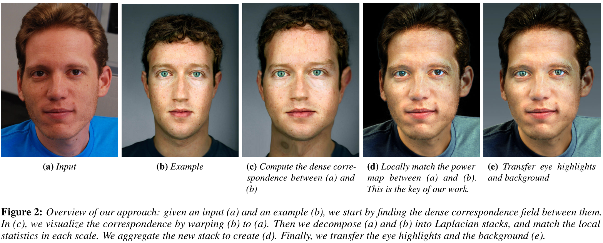

# 34 Style Transfer for Headshot Portraits
***
### GitHub Link: - https://github.com/Digital-Image-Processing-IIITH/project-mandelbrot

Team Members | Roll Number
--- | --- 
Amarthya Sasi Kiran Dharmala | 20171110
Sai Krishna Charan Dara | 20171140
Sai Deva Harsha Annam | 20171136
Voora Venkata Susheel | 20171164

### Main goal of the Project: -
* Achieving a compelling visual style for photography requires advanced skills that a casual photographer will not have. In this project, We implement the technique that transfers the style of an example head-shot photo onto a new one. This can allow one to easily reproduce the look of renowned artists.

### Project Definition: -
* Users provide an input portrait photo and an example stylized portrait, and our algorithm processes the input to give it same visual look as the example. The output headshot that we seek to achieve is the input subject, but as if taken under the same lighting and retouched in the same way as the example.
   #### Steps to the proposed technique:-
   1. First establish a dense correspondence between the input and the model, that is, each input pixel is put in correspondence with a pixel of the model.
   2. Secondly, we transfer the local statistics of model onto the input.
   3. Finally, transfer the eye highlights and the background.
   

### Result of the Project: -
 
 ### Procedure of the technique (Brief): -
 1. Dense Correspondence
 2. Multiscale Transfer of Local Contrast which includes,
    1. Multiscale Decomposition 
    2. Local Energy
    3. Robust Transfer
    4. Dealing with Colors
    5. Using a Mask
 3. Additional Postprocessing
     1. Eye Highlights
     2. Background
 4. Automatic Selection of the Example in a Collection

### Project milestones and expected timeline: -
Timeline | Tasks to be completed | Percentage of completion 
--- | --- | ---
 26th October|  Dense Correspondence | `20-25%`
 7th November| Multiscale Transfer of Local Contrast | `65-70%`
 11th November| Additional Postprocessing | `85%`
 17th November | Automatic Selection of the Example in a collection | `100%`

### Data Set: -
* 94 photos collected from the photography website Flickr. The dataset contains a large variety of casual headshot photos with various facial features such as beard, accessories, and glasses, as well as people of different gender, age, skin color, and facial expression 
* This dataset is challenging because some photos are noisy due to low-light conditions, and the background can be cluttered which makes matting hard. 
